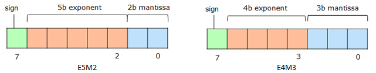

# FP8 Emulation Toolkit  
## Introduction
This repository provides PyTorch tools to emulate the new `FP8` formats as defined by the joint specification from <a href=https://arxiv.org/pdf/2209.05433https://arxiv.org/pdf/2209.05433 target="_blank">ARM-Intel-NVIDIA</a>. The toolkit suports two binary formats namely `E5M2` and `E4M3`, emulated on top of existing floating point hardware from Intel (FP32) and NVIDIA (FP16). 

Following table shows the binary formats and the numeric range: 

|                |                                 E5M2                             |                               E4M3                               |
| -------------- | ---------------------------------------------------------------- | ---------------------------------------------------------------- |
| Exponent Bias  |                                 15                               |                                  7                               |
| Infinities     | S.11111.00<sub>2</sub>                                           |                                 N/A                              |
| NaNs           | S.11111.{01, 10, 11}<sub>2</sub>                                 | S.1111.111<sub>2</sub>                                           |
| Zeros          | S.00000.00<sub>2</sub>                                           | S.0000.000<sub>2</sub>                                           |
| Max normal     | S.11110.11<sub>2</sub>=1.75 * 2<sup>15</sup>=57344.0             | S.1111.110<sub>2</sub>=1.75 * 2<sup>8</sup>=448.0                |
| Min normal     | S.00001.00<sub>2</sub>=2<sup>-14</sup>=6.1e<sup>-05</sup>        | S.0001.000<sub>2</sub>=2<sup>-6</sup>=1.5e<sup>-02</sup>         |
| Max subnormal  | S.00000.11<sub>2</sub>=0.75 * 2<sup>-14</sup>=4.5e<sup>-05</sup> | S.0000.111<sub>2</sub>=0.875 * 2<sup>-6</sup>=1.3e<sup>-03</sup> |
| Min subnormal  | S.00000.01<sub>2</sub>=2<sup>-16</sup>=1.5e<sup>-05</sup>        | S.0000.001<sub>2</sub>=2<sup>-9</sup>=1.9e<sup>-03</sup>         |
	
 

## Installation

Follow the instructions below to install FP8 Emulation Toolkit in a Python virtual environment. 
Alternatively, this installation can also be performed in a docker environment. 

### Requirements
Install or upgrade the following packages on your linux machine.

* Python >= 3.8.5 
* CUDA >= 11.1 
* gcc >= 8.4.0 

Make sure these versions are reflected in the `$PATH`

#### Target Hardware
* CPU >= Icelake Xeon
* GPU >= V100 

### Create a Python virtual environment
```
$ python3 -m ~/py-venv 
$ cd ~/py-venv  
$ source bin/activate 
$ pip3 install --upgrade pip3 
```
### Clone and install FP8 Emulation Toolkit
```
$ git clone https://github.com/IntelLabs/FP8-Emulation-Toolkit.git
$ cd FP8-Emulation-Toolkit 
$ pip3 install -r requirements.txt 
$ python setup.py install 
```

## Usage Examples
The emulated FP8 formats can be experimented with by integrated them into standard deep learning flows. Please check the `examples` folder for code samples. Following example demonstrates the post-training quantization flow for converting pre-trained models to use FP8 for inference. 

```
# import the emulator
from mpemu import mpt_emu

...

# layers exempt from e4m3 conversion
list_exempt_layers = ["conv1","fc"]

model, emulator = mpt_emu.quantize_model (model, dtype="e4m3_rne", "None",
                               list_exempt_layers=list_exempt_layers)

# calibrate the model for a few batches of training data
evaluate(model, criterion, train_loader, device,
           num_batches=<num_calibration_batches>, train=True)

# Fuse BatchNorm layers and quantize the model
model = emulator.fuse_layers_and_quantize_model(model)

# Evaluate the quantized model
evaluate(model, criterion, test_loader, device)

```
An example demostrating post-training quantization can be found [here](./examples/inference/classifier/imagenet_test.py). 

